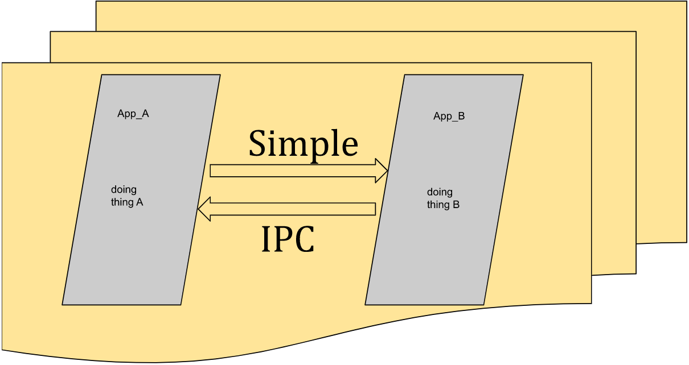

 
  

<h1 align="center"> Simple IPC </h1>
<h3 align="center"> The Easiest Way to Communicate with Other Applications </h3>  

 

<!-- TABLE OF CONTENTS -->
<h2 id="table-of-contents"> Table of Contents</h2>

  
Table of Contents

  <ol>
    <li><a href="#about-the-project"> ➤ About The Project</a></li>
    <li><a href="#prerequisites"> ➤ Prerequisites</a></li>
    <li><a href="#folder-structure"> ➤ Folder Structure</a></li>
    <li><a href="#arguments-details"> ➤ Arguments Details</a></li>
    <li><a href="#how-to-use"> ➤ How to Use</a></li>
    <li><a href="#api-details"> ➤ API Details</a></li>
    <li><a href="#limitations"> ➤ Limitations</a></li>
    <li><a href="#license"> ➤ License</a></li>
  </ol>

<!-- ABOUT THE PROJECT -->
<h2 id="about-the-project"> About The Project</h2>

 
  Inter Process Communşcatşon could be painful sometimes. In most complex projects, there should be a generic way (a communication bus) for all the processes to communicate each other easily and freely.

  So, I decided to write this application. Because with this application, I can do the followings;

  * Offer an easy interface to use. Just give a "topic" arguments to the APIs that send or receive the conversation about it
  * Seperate asynch callback mechanism is used
  * Easy integration
  * Special API exists to broadcast data

<!-- PREREQUISITES -->
<h2 id="prerequisites"> Prerequisites</h2>

  
  
  
  

No third party packets used in this project.

<!-- FOLDER STRUCTURE -->
<h2 id="folder-structure"> Folder Structure</h2>

    code
    .
    │
    ├── pictures
    │   ├── simple_ipc.png
    ├── common
    │   ├── include
    |       ├── sipc_common.h
    │   ├── sipc_common.c
    │   ├── Makefile
    ├── daemon
    │   ├── daemon.c
    │   ├── Makefile
    ├── libsipcc
    │   ├── include
    |       ├── sipc_lib.h
    │   ├── sipc_lib.c
    │   ├── Makefile
    ├── test
    │   ├── test.c
    │   ├── Makefile
    │
    ├── Config
    ├── LICENSE 
    ├── Makefile  
    ├── README.md 
    ├── environment  

* pictures folder: contains pictures used in the README.md file.
* test folder: contains example application that use simple ipc api.
* common folder: contains common functions for library and daemon.
* daemon folder: contains manager application source codes.
* libsipcc folder: contains source codes to generate library
* Config file: contains debug open option
* LICENSE file: contains license information
* Makefile: makefile to compile the program
* README.md file: readme itself
* environment file: arrange LD_LIBRARY_PATH environment to execute test application which uses the dynmaic library  

<!-- ARGUMENTS -->
<h2 id="arguments-details"> Arguments' Details</h2>

    

There is no special arguments except "help" and "version".

	--version         	(-v): shows version

	--help            	(-h): shows arguments

<!-- HOWTO -->
<h2 id="how-to-use"> How to Use</h2>

1. type "make" and start "sipcd" first which is the manager app in the daemon folder.
    - Note that, you may type 'n' the OPEN_DEBUG config in the 'Config' file to disable debugs
2. After compilation, libsipcc.so should be created under the libsipcc folder.
3. After the library creation, test applications can be run
    - Note that, you can run the test application multiple times to observe sending data to eachother.
    - At least one arg should be given to the test app which will be the title to be listened by the app
    - After execution, you may type "\<title\>\<space\>\<data\>" format to send data to other (or itself) applications
4. Then you are OK.

<!-- APIDETAILS -->
<h2 id="api-details"> API Details</h2>

> ___int sipc_register(char *title, int (*callback)(void *, unsigned int), unsigned int timeout);__  
>> This function is used to register a 'title'  
>> timeout arg is optional  
>> 'callback' is the callback function that automatically executed if there is any incoming data. Passing args to that callback are data itself and its length  
>> eg callback definition: **int my_callback(void *prm, unsigned int len)**  
>> Please note that, it is recommanded that callback functions' content should be light weight or thread safe

> ___int sipc_send_data(char *title, void *data, unsigned int len);__  
>> used to send data to specific 'title' listeners  

> ___int sipc_send_bradcast_data(char *title, void *data, unsigned int len);__  
>> used to send broadcast data to specific 'title' listeners  

> ___int sipc_unregister(char *title);__  
>> used to be removed from 'title' caller list  

> ___int sipc_broadcast_register(int (*callback)(void *, unsigned int));__  
>> used to register to broadcasted data  

> ___int sipc_broadcast_unregister(void);__  
>> used to unregister broadcasted data  

> ___int sipc_destroy(void);__  
>> used for freed all allocated memories hold by the library  

<!-- LIMITS -->
<h2 id="limitations"> Limitations</h2>

* sipcd must be executed before other applications' registration. You may use register function as blocking with timeout parameter
* sipcd can serve number of 'BACKLOG' applications defined in "s,pc_common.h"
* If an application sends data to a title and if there is **no** application registered to this title before, we are calling this data as orphan. sipcd queues these orphan data and serves them when an application registers the specified title. Please note that, these data are not cleared. It means, if there will a new rgistiration to any orphan title, and if the new registration came from a new application, the new registered application will get these old orphan data.

<!-- LICENSE -->
<h2 id="license"> License</h2>

<h3 align="left"> This project is completely FREE </h3>

